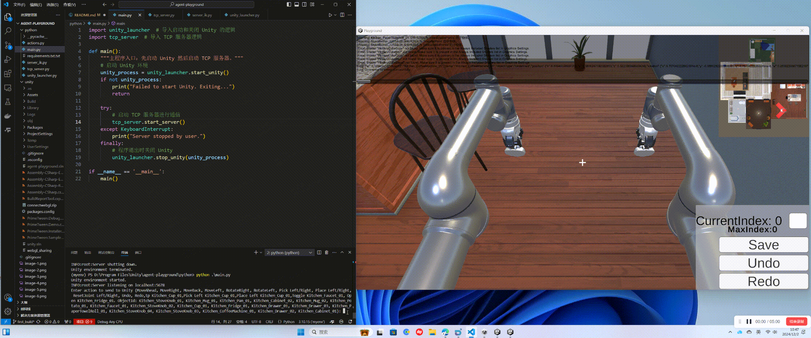
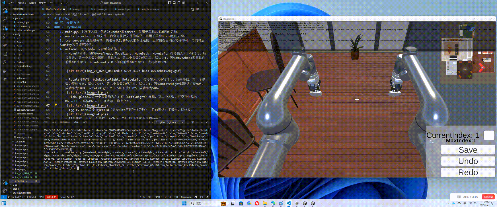
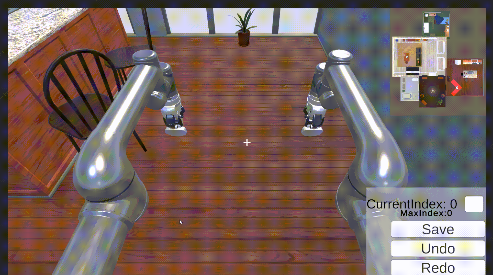
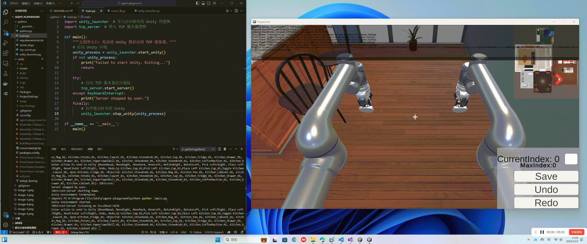
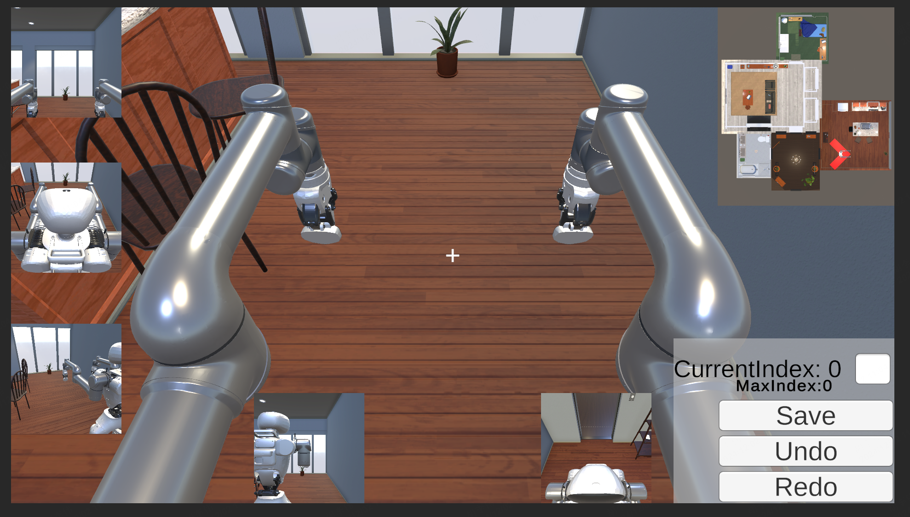

# 项目简介
这是一个使用 Python 和 Unity 实现的仿真环境，灵感来源于 AI2-THOR。为Agent提供了一个 3D 环境，用于进行各种任务（如机器人控制、物体交互等），可以用于测评、训练具身智能体、多模态模型等，并且可以帮助开发和测试与视觉、语音、强化学习等相关的 AI 系统。

### 新增功能点：
- 概率系统：该版本新增了概率系统，可以自定义设置success rate来控制单独控制每个action的成功率。
- 运控动作：已对接了IK库来实现动作设计，代替原先的直接吸附传递。

## 一、功能
- 智能体控制：使用 Python 控制智能体在 3D 环境中移动、旋转、拾取物体等Action。
- 物体交互：智能体可以与环境中的物体进行互动，例如抓取、放置、切换、开关门等。
- 任务执行：支持自定义任务场景，智能体可以完成复杂的任务（例如从一个位置移动到另一个位置，或将物品放置到特定位置）。

## 二、安装
### 1. 克隆项目
git clone https://github.com/AgentX-Agibot/agent-playground.git  （rebuild分支）

### 2. 启动配置文件
---

#### 1. Python 环境
确保已安装 Python 版本 `3.10.15`。

---

#### 2. 安装所需库
进入 `python` 目录，安装依赖库：

```bash
cd python
pip install -r requirements.txt
```

---

#### 3. 启动 Agent Server
1. 新建另一个终端。
2. 输入以下指令启动 Agent Server：

```bash
python main.py
```


## 三、操作方法

### 1. IK服务端：
事先说明，在动作执行之前，必须得启动IKServer，否则和机械臂相关的动作无法正常执行。
### 2. Python端：
该配置内含四个文件，分别是main，actions，tcp_server，unity_launcher。
   1. main.py：主程序入口，包含launcher和server，仅用于单独Build包的启动。
   2. unity_launcher：启动文件，内含可执行文件的路径，也用于单独Build包的启动。
   3. tcp_server：通信服务端，需要确认Ip和Post来保证连接，正常情况启动该文件即可，再同时启动unity项目即可通信。
   4. actions：动作脚本，内含所有动作方法。
      - Move即移动，包括`MoveAhead`, `MoveRight`, `MoveBack`, `MoveLeft`，指令输入大小写均可。后接参数，第一个参数为幅度，默认为1；第二个参数为成功率，默认为1。例如MoveAhead即默认向前移动1个单位，`MoveAhead 2 0.5`即向前移动2个单位，成功率为50%。
      
      - Rotate即旋转，包括`RotateRight`, `RotateLeft`，指令输入大小写均可。后接参数，第一个参数为旋转方向，默认为90°；第二个参数为成功率，默认为1。例如RotateRight即默认右旋90°，成功率为100%，`RotateRight 2 0.5`即右旋180°，成功率为50%。
      
      - Pick、place后第一个参数均为左右臂（Left\Right）选择，第二个参数为可交互物品的ObjectId，详情ObjectId在表格中均有介绍。
      
      - tggle、open后接ObjectId（需提前tp至该物体旁边），目前默认右手操作，待修改。
      
      - TP即传送，只有一个参数，为ObjectId，即可传送至该物品旁边。
      - Undo和Redo为历史状态管理，Redo可回溯到上一次状态信息，而Undo为撤销。
      
      - Reset_joint为复位机械臂关节角，恢复至初始关节角，后接参数（Left\Right）。

反馈系统：在动作执行完成后会自动返回反馈所有状态信息，包括机器人及物品等。

### 3. Unity端：
  - 需提前确认IP和POST保证正常连接，当前默认localhost和5678。
  - 按 Z 即可进入机器人控制模式，WSAD去控制机器人的移动，鼠标控制旋转，屏幕中心对准可交互物品即可进行交互。比如左键Pick，再次点击左键即可Place；对准水龙头即可进行水的开关，对准冰箱即可开关门等等，详情可见[交互表格](#交互表格)。
  - 按 P 键保存所有相机图像，包括第一、三人称在内的所有相机截图保存在本地目录。
  - 按 数字0 键进入漫游相机模式，即脱离整体进行。


## 四、视觉系统
1. 场景设有多个相机，包括第一人称和第三人称的前后左右视角，来提供360°全景无死角视角来进行图像信息获取，支持全方向自由旋转，确保机器人能实时监控周围环境，并且后续可根据需求定制视角的数量和方向。（全部展示的话太耗费性能，所以具体如何展示视角还待商量）

2. 提供相机视野内的深度图获取。
3. 设有小地图，时刻关联机器人在场景中的位置，帮助玩家快速了解整体环境布局。
4. 将每个视角的图像数据保存为带有UUID的PNG文件，放在本地目录下，后续可将图片数据转成二进制数据传输。


## 五、物品交互系统
### 1. 物品分类
将物体分为了三类：Static/Moveable/Can pickup。
1. Static：场景中无法移动的物体。如开关，水龙头。
2. Moveable：场景中可以被移动但不能被抓起的物体。如咖啡机。
3. Can Pickup:场景中可以被抓起的物体。如土豆，马克杯。
### 2. 可交互状态
一共设置了八种交互状态：
1. **Break**：物品可被摔碎。如杯子从高处落下碰到地面受到足够的力后会被摔碎。
2. **Can PickUp**:物品可被抓起。被分为了Can Pickup的物品才可被抓起。
3. **Contains**:物品可作为容器，容纳其它物体。可以获取父容器容纳的子物品ID，也可以获取容纳子物品的父容器ID信息。
4. **Cook**：物品可被煮熟。如土豆在锅里同时打开燃气，被加热到达一定温度时，土豆会变熟。
5. **Fill**：物品可被液体填充。如杯子可以被水，咖啡填充。将杯子倾斜90°后，填充液体会消失。
6. **Open**：物品可被打开。如打开冰箱门，打开抽屉。
7. **Slice**： 物品可被切开。如将土豆切开成很多片。被切开的物品如果具有Cook属性，也会被煮熟。
8. **ToggleOnOff**：物品可被切换。如水龙头开关，咖啡机开关。
9. **UsedUp**：物品可被使用完。如卫生纸可以被耗尽。
### 3. 交互表格
这个表格列举了目前所有可交互物品的种类，物品ID命名（房间_物品种类_0X，X表示序号）所在房间，具有的交互状态和备注。
| 物品种类   |物品ID格式| 所在房间 | 可交互状态 | 备注 |
|:-: |:-:|:-:|:-:|:-:|
| Cabinet   |Kitchen_Cabinet_0X| Kitchen   | Contains,Open  | |
| CoffeeMachine   |Kitchen_CoffeeMachine_0X|  Kitchen  | Contains,ToggleOnOff   |    |
| Drawer   |Kitchen_Drawer_0X| Kithcen   | Contains,Open   |    |
| Faucet   |Kitchen_Faucet_0X| Kithcen   | ToggleOnOff   |    |
| Fridge   |Kitchen_Fridge_0X| Kithcen   | Contains,Open  |    |
| Mug   |Kitchen_Mug_0X| Kithcen   | Break,Can pickup,Fill   |    |
| Pan   |Kitchen_Pan_0X| Kithcen   | Can pickup,Contains   |   |
| PaperTowerRoll   |Kitchen_PaperTowerRoll_0X| Kithcen   | Can pickup,UsedUp   |   |
| Potato   |Kitchen_Potato_0X| Kithcen   | Can pickup,Cook,Slice   | 土豆可被煮熟，也可切开后再被煮熟  |
| StoveKnob   |Kitchen_StoveKnob_0X| Kithcen   | ToggleOnOff   |  燃气灶开关  |


