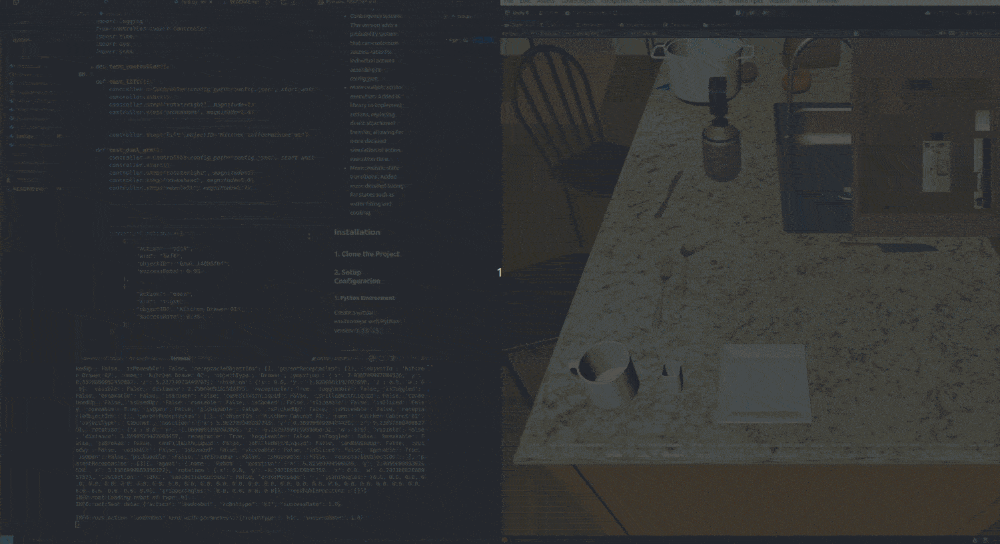
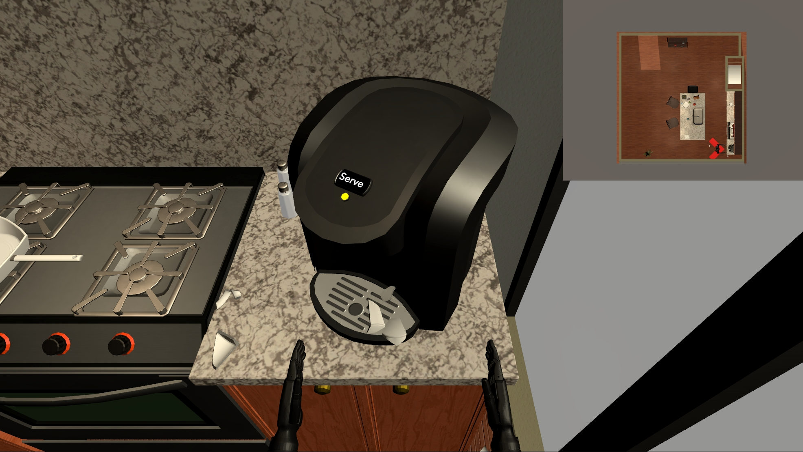
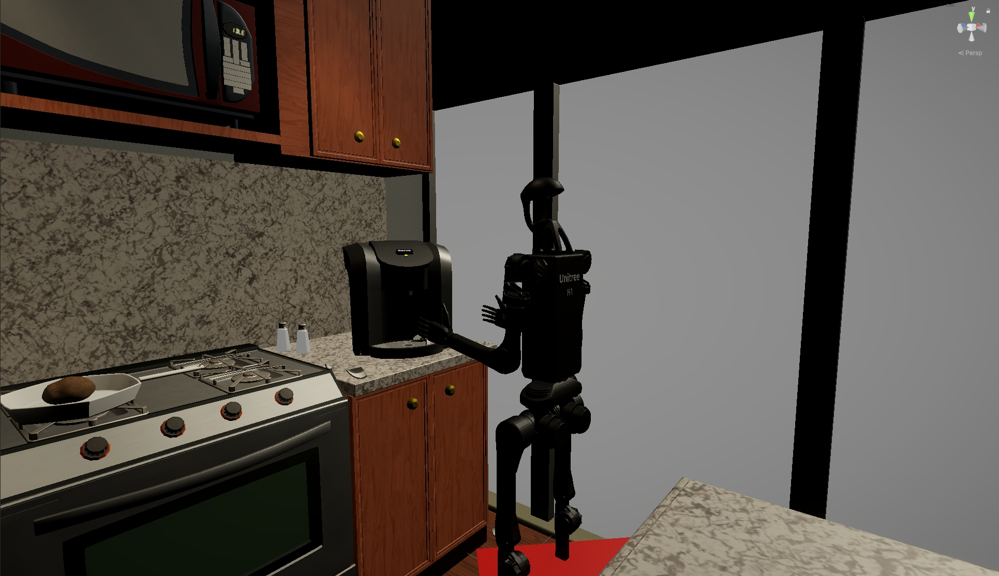
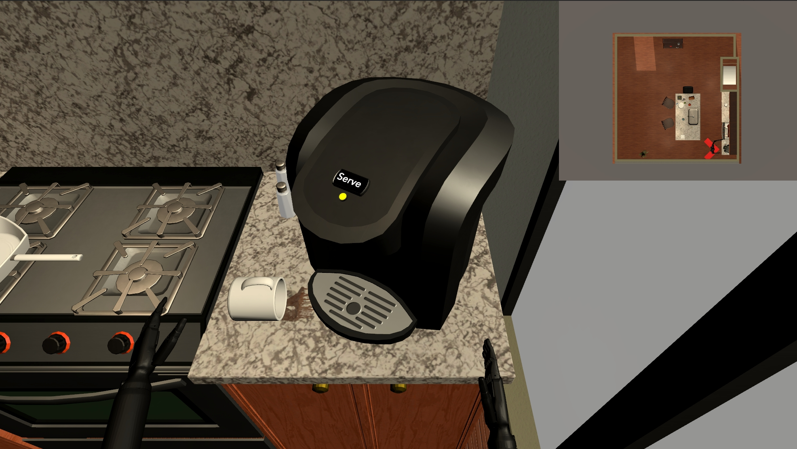
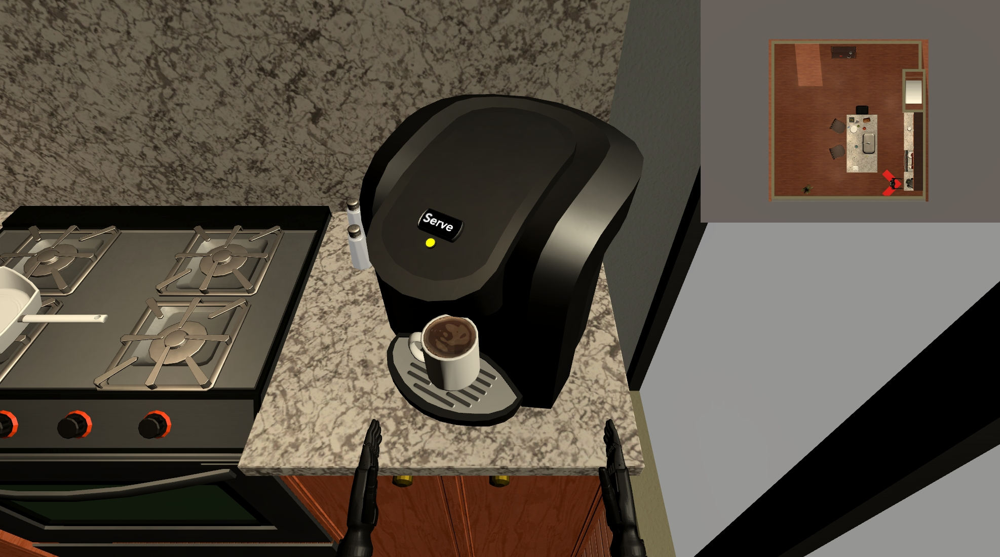
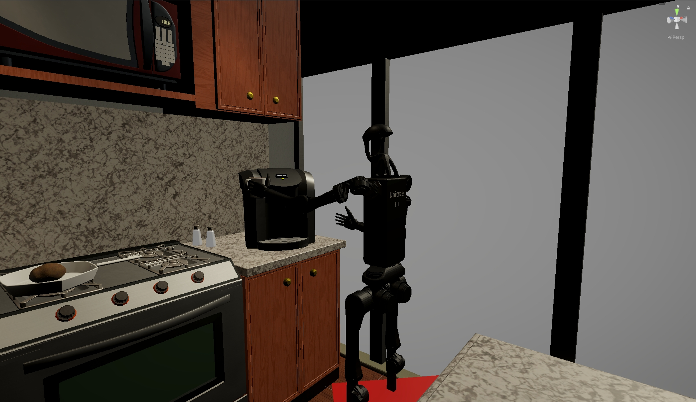
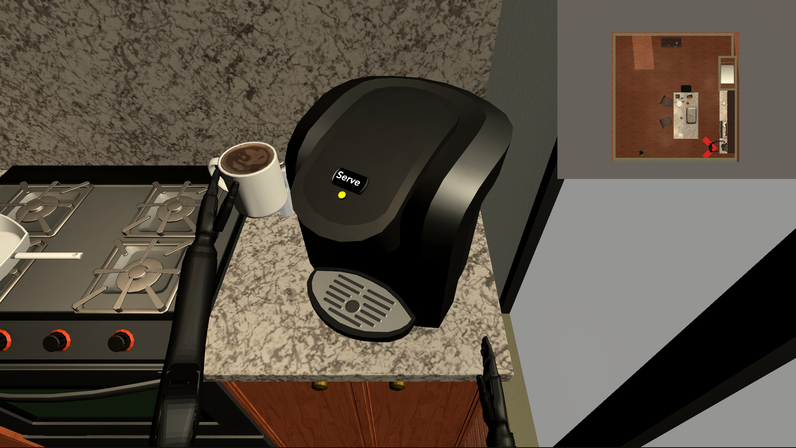

# DualTHOR: A Dual-Arm Humanoid Simulation Platform for Contingency-Aware Planning

<div align="center">

<!-- [[Website]](https://) -->
[[arXiv]](https://arxiv.org/abs/2506.16012)

[]()
[]()

</div>

We have built a lightweight simulation environment based on [AI2-THOR](https://ai2thor.allenai.org/) for training and evaluation of embodied agents and multimodal models. Extendidng AI2-THOR capabilities, we have added the following features:
- Dual-arm task setup: Support more diverse dual-arm tasks including dual-arm essential tasks, dual-arm optional tasks, and single-arm tasks.
- Dual-arm action execution: Now support parallel task execution with both arms.
- Task replay mechanism: Support rolling back to any time step during task execution, improving data synthesis efficiency.
- Contingency system: Added a probability system that can customize success/failure rates for individual actions according to config.json.
- More realistic action execution: Added IK library to implement actions, replacing direct attachment transfer, allowing for more detailed simulation of continuous action execution time.
- More realistic state transitions: Added more detailed tuning for states such as water filling and cooking.


## Installation
### 1. Clone the Project

### 2. Setup Configuration

#### 1. Python Environment
Create a virtual environment with Python version `3.10.15`.
```
conda create -n playground python=3.10.15
conda activate playground
```


#### 2. Install Required Libraries

Basic dependency installation

```bash
conda create -n playground python=3.10.15
conda activate playground
cd python
pip install -r requirements.txt
```

IK (inverse kinematics)
```bash
conda install pinocchio -c conda-forge
pip install meshcat
pip install casadi
```


#### 3. Start Agent Server

```bash
python test.py
```

## Interaction

Python is mainly used to control the Agent in the virtual environment to perform navigation, interaction, control, and other tasks, as well as to obtain perception data from the environment. The main scripts are:

   1. test.py: Main program entry, including launcher, tcp_server, server_ik; simply test the performance of humanoid robot low-level control.

   2. controller.py: Controller program, responsible for interacting with the Unity environment, starting the server, calling action methods, sending and providing feedback.

   3. config.json: Configuration file, currently only contains success rate definitions; more parameters can be added as needed.

   4. actions: Action scripts containing all action methods.

   Two control modes: user command line input control and controller.step calling action control.
      - Move includes `MoveAhead`, `MoveRight`, `MoveBack`, `MoveLeft`, command input can be uppercase or lowercase. Followed by parameters, the first parameter is Magnitude, default is 1. For example, `MoveAhead Magnitude=1` means move forward 1 unit by default, `MoveAhead Magnitude=2` means move forward 2 units.
      
      - Rotate includes `RotateRight`, `RotateLeft`, command input can be uppercase or lowercase. Followed by parameters, the first parameter is rotation direction, default is 90°; the second parameter is success rate, default is 1. For example, `RotateRight Magnitude=1` means rotate right 90° by default, `RotateRight Magnitude=2` means rotate right 180°.
      
      - Pick is for grabbing objects (need to navigate to the object first), the first parameter is arm selection (Left/Right) (currently defaulting to both arms, pending modification), the second parameter is the ObjectId of the interactive item. For example, `pick arm=left objectID=Kitchen_Cup_01` means grab the Cup with the left arm.
      
      - Place is for placing objects. The place operation is based on a prior pick operation, meaning it assumes that there is already an object in the left/right arm by default. Like Pick, the first parameter of Placing is arm selection(Left/Right), And the third parameter, container, is optional. It indicates which container the object should be placed into. For example, `place arm=left container=Plate_49b95a7a` means place the object in left arm into the container named 'Plate_49b95a7a'.
      
      - Toggle and Open followed by ObjectId (need to teleport to the object first), currently defaults to right hand operation, pending modification. For example,`toggle Kitchen_Faucet_01` means turn on the faucet with default right arm.
      
      - "Lift" represents a bimanual operation, typically used for heavier and larger objects — often appliances — that require the use of both arms. By default, the "Lift" action uses both arms. The input parameter is the ObjectID.
      
      - TP means teleport, with only one parameter, ObjectId, which teleports to the vicinity of that item.
      - Undo and Redo are for state history management, Redo can roll back to the previous state information, while Undo is to cancel.
      - LoadState is for specified rollback, followed by the specified state id. For example, `loadstate stateID=1` means roll back to the first state.
      
      - Resetjoint resets the mechanical arm joint angle, restoring to the initial joint angle, followed by parameter (arm=Left/Right). For example, `resetjoint arm=left`.
      

   5. Feedback System: After the action is completed, all state information will be automatically returned as feedback, including the robot and items.


## Visual Observation

1. The scene has multiple cameras (including first-person and third-person) front, back, left, and right views, to provide 360° panoramic view with no blind spots for image information acquisition, supporting free rotation in all directions, ensuring the robot can monitor the surrounding environment in real time, and the number and direction of views can be customized according to requirements. (Showing all views would be too performance-intensive, so how to display views is still to be re-designed)


2. Provides depth map acquisition within the camera's field of view.

3. Features a mini-map that constantly relates the robot's position in the scene, helping players quickly understand the overall environmental layout.

4. Saves image data from each view as PNG files with UUIDs in the local directory, which can later be converted for transmission.


## Item Details

### 1. Item Classification

Objects are divided into three categories: Static/Moveable/Can pickup.

1. Static: Objects that cannot be moved in the scene. Such as switches, faucets.

2. Moveable: Objects that can be moved in the scene but cannot be picked up. Such as coffee machines.

3. Can Pickup: Objects that can be picked up in the scene. Such as potatoes, mugs.

### 2. Interactive States

A total of ten interaction states are set:

1. **Break**: Items can be broken. For example, a cup falling from a height and hitting the ground with enough force will break.

2. **Can PickUp**: Items can be picked up. Only items categorized as Can Pickup can be picked up.

3. **Contains**: Items can serve as containers for other objects. You can get the ID of child items contained in a parent container, or get the ID of the parent container containing child items.

4. **Cook**: Items can be cooked. For example, when a potato in a pot is heated to a certain temperature with the gas turned on, the potato will be cooked.

5. **Fill**: Items can be filled with liquid. For example, a cup can be filled with water or coffee. When the cup is tilted 90°, the filled liquid will empty out.

6. **Open**: Items can be opened. Such as opening a refrigerator door or a drawer.

7. **IsMovable**: Items that can be moved corresponding to the action "lift", such as a coffee machine.

8. **ToggleOnOff**: Items can be toggled. Such as faucet, switches, coffee machine buttons.

9. **UsedUp**: Items can be used up. Such as toilet paper, which can be depleted.

10.**Spill**: Items can contain content that can be spilled. Such as cup filled with liquid.

### 3. Contingency Mechanism

The Contingency Mechanism in DualTHOR provides a realistic action execution model with configurable probabilities of success and failure. The mechanism includes:

1. **Configurable Success Rates**: Each action type (pick, place, toggle, etc.) has a base success rate that can be customized in ErrorConfig.json.

2. **Object-Specific Success Rates**: Success rates can be further customized based on object type and state (e.g., filled cups have different success rates than empty cups).

3. **Contextual Error Messages**: When actions fail, the system selects appropriate error messages from a weighted probability pool, providing realistic feedback.

4. **Automatic State Transitions**: Failed actions can trigger automatic state changes in objects (e.g., a dropped cup might break or spill its contents).

5. **Implementation**: 
   - Action success is determined by comparing a random value against the configured success rate
   - Error messages are selected based on their configured probability weights
   - The system can automatically apply state changes to affected objects

This system creates more realistic interactions where actions can occasionally fail, requiring agents to adapt and recover, similar to real-world robotic task execution.

### Example of picking action

<div style="display:flex; gap:2%">
  
  
</div>
<p align="center"><strong>Broken</strong></p>

<br>
<div style="display:flex; gap:2%">
  
  
</div>
<p align="center"><strong>Spilled</strong></p>

<br>
<div style="display:flex; gap:2%">
  
  
</div>
<p align="center"><strong>Nothing happens</strong></p>

<br>
<div style="display:flex; gap:2%">
  
  
</div>
<p align="center"><strong>Success</strong></p>


## Extended Development
If you want to add some features or make modifications yourself, please install Unity Editor 2022.3.x or Unity 6. Then open the unity directory in the Unity Editor. After making your changes, rebuild the project to the unity/Build directory.

If you want to debug with Unity Editor, please change the controller parameter "start_unity_exe" to False.


## Citation
If you find our work useful, please consider citing us!
```
@article{li2025dualthor,
    title={DualTHOR: A Dual-Arm Humanoid Simulation Platform for Contingency-Aware Planning},
    author={Boyu Li, Siyuan He, Hang Xu, Haoqi Yuan, Yu Zang, Liwei Hu, Junpeng Yue, Zhenxiong Jiang, Pengbo Hu, B{\"o}rje F. Karlsson, Yehui Tang, Zongqing Lu},
    journal={arXiv preprint arXiv:2506.16012},
    year={2025}
}
```
