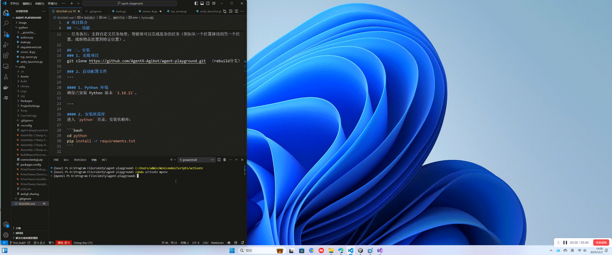
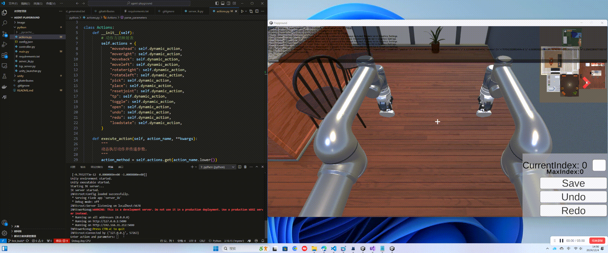
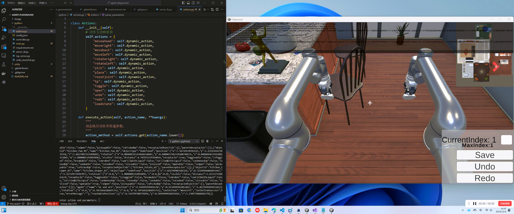
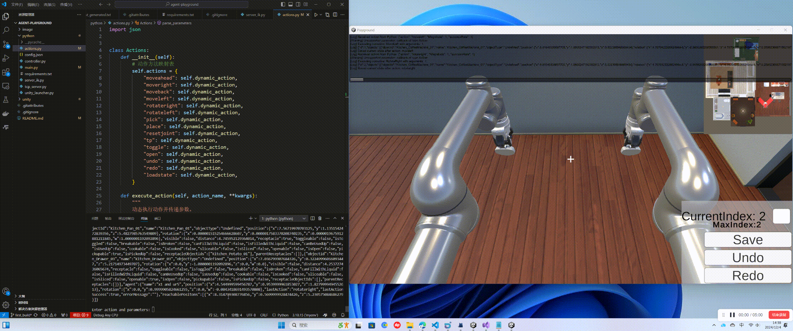
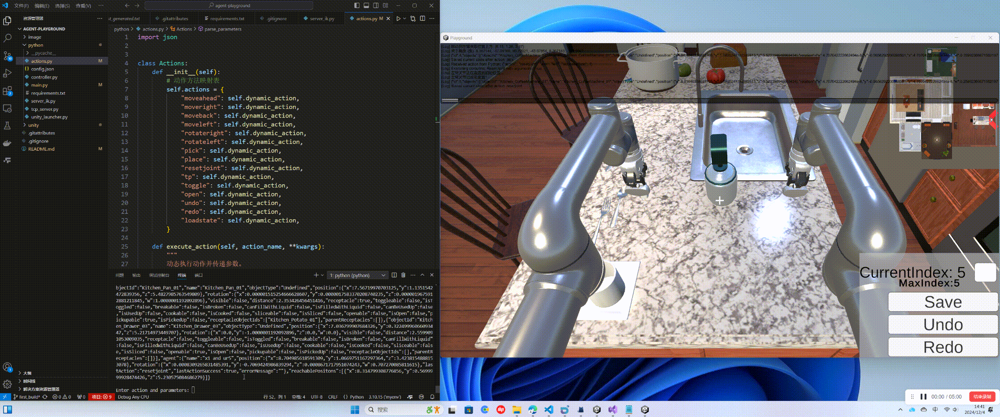
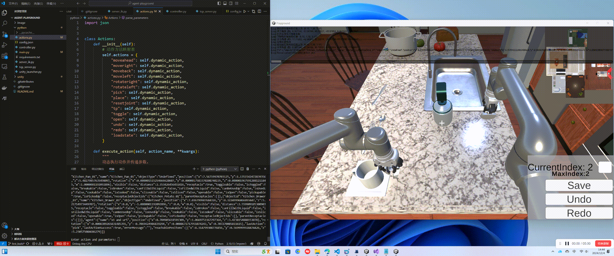
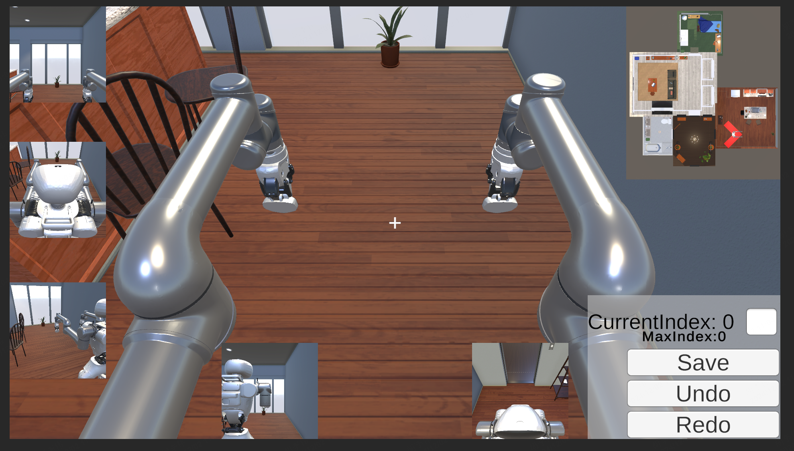

# 项目简介
我们基于[AI2-THOR](https://ai2thor.allenai.org/)构建了一个轻量化的、能在web端运行的仿真环境，用于具身智能体和多模态模型的训练和测评。在AI2-THOR的基础上，我们新增了下述功能：
- 双臂动作执行：现在支持双臂进行并行、异步任务执行。
- 任务回溯：支持在任务执行过程中回退到任意时间步，提升数据合成效率。
- 动作概率系统：该版本新增了概率系统，可以根据config.json自定义设置success rate来控制单独控制每个action的成功率。
- 更真实的动作执行：添加了IK库来实现动作，取代了直接吸附传递，可以对动作执行时间做更加细节的模拟。
- 更真实的状态变化：对注水、煮熟等状态添加了更多细节的调优。


## 安装
### 1. 克隆项目
```git clone -b https://github.com/AgentX-Agibot/agent-playground.git```

### 2. 启动配置文件
---

#### 1. Python 环境
创建虚拟环境 Python 版本 `3.10.15`。
```
conda create -n playground python=3.10.15
conda activate playground
```
---

#### 2. 安装所需库

宇树DDS（unitree_dds_wrapper）

```
conda create -n playground python=3.10.15
conda activate playground
# Install the Python version of the unitree_dds_wrapper.
git clone https://github.com/unitreerobotics/unitree_dds_wrapper.git
cd unitree_dds_wrapper/python
pip install -e .
```

IK(inverse kinematics)
```
conda install pinocchio -c conda-forge
pip install meshcat
pip install casadi
```

其他依赖库安装

```bash
cd python
pip install -r requirements.txt
```
---

#### 3. 启动 Agent Server

```bash
python main.py
```


## 操作方法

### 1. Python端：
Python主要用于控制虚拟环境中的Agent，以执行导航、交互、控制等任务，并从环境中获取感知数据。主要脚本有：
   1. main.py：主程序入口，包含launcher、tcp_server、server_ik，直接启动该文件即可。
   2. controller.py：控制器程序，负责与Unity环境交互、启动server端、调用action方法、发送并反馈。
   3. config.json：配置文件，目前暂时只有success rate，后续可根据需求增加更多参数。
   4. actions：动作脚本，内含所有动作方法。
   两种控制模式：用户命令行输入控制和controller.step调用action控制。
      - Move即移动，包括`MoveAhead`, `MoveRight`, `MoveBack`, `MoveLeft`，指令输入大小写均可。后接参数，第一个参数为幅度Magnitude，默认为1。例如`MoveAhead Magnitude=1`即默认向前移动1个单位，`MoveAhead Magnitude=2 `即向前移动2个单位。
      
      - Rotate即旋转，包括`RotateRight`, `RotateLeft`，指令输入大小写均可。后接参数，第一个参数为旋转方向，默认为90°；第二个参数为成功率，默认为1。例如`RotateRight Magnitude=1`即默认右旋90°，`RotateRight Magnitude=2 `即右旋180°。
      
      - Pick、Place后为抓和放（需提前tp至该物体旁边），第一个参数均为左右臂（Left\Right）选择（目前默认左右操作，待修改），第二个参数为可交互物品的ObjectId，详情ObjectId在表格中均有介绍。例如`tp objectID=Kitchen_Cup_01` `pick arm=left objectID=Kitchen_Cup_01`即先传送到Cup旁边，然后左臂抓起Cup。
      
      - Toggle、Open后接ObjectId（需提前tp至该物体旁边），目前默认右手操作，待修改。例如`tp Kitchen_Faucet_01` `toggle Kitchen_Faucet_01`即传送到水龙头旁边打开水龙头。
      
      - TP即传送，只有一个参数，为ObjectId，即可传送至该物品旁边。
      - Undo和Redo为历史状态管理，Redo可回溯到上一次状态信息，而Undo为撤销。
      - LoadState为指定回溯，后接指定状态id。例如`loadstate stateID=1`即回溯到第1个状态。
      
      - Resetjoint为复位机械臂关节角，恢复至初始关节角，后接参数（arm=Left\Right）。例如`resetjoint arm=left`。
      

#### 反馈系统：在动作执行完成后会自动返回反馈所有状态信息，包括机器人及物品等。

### 2. Unity端：
  - 需提前确认IP和PORT保证正常连接，当前默认localhost和5678。
  - 按 Z 即可进入机器人控制模式，WSAD去控制机器人的移动，鼠标控制旋转，屏幕中心对准可交互物品即可进行交互。比如左键Pick，再次点击左键即可Place；对准水龙头即可进行水的开关，对准冰箱即可开关门等等，详情可见[交互表格](#交互表格)。
  - 按 P 键保存所有相机图像，包括第一、三人称在内的所有相机截图保存在本地目录。
  - 按 数字0 键进入漫游相机模式，即脱离整体进行。


## 视觉系统
1. 场景设有多个相机，包括第一人称和第三人称的前后左右视角，来提供360°全景无死角视角来进行图像信息获取，支持全方向自由旋转，确保机器人能实时监控周围环境，并且后续可根据需求定制视角的数量和方向。（全部展示的话太耗费性能，所以具体如何展示视角还待商量）

2. 提供相机视野内的深度图获取。
3. 设有小地图，时刻关联机器人在场景中的位置，帮助玩家快速了解整体环境布局。
4. 将每个视角的图像数据保存为带有UUID的PNG文件，放在本地目录下，后续可将图片数据转成二进制数据传输。


## 物品交互系统
### 1. 物品分类
将物体分为了三类：Static/Moveable/Can pickup。
1. Static：场景中无法移动的物体。如开关，水龙头。
2. Moveable：场景中可以被移动但不能被抓起的物体。如咖啡机。
3. Can Pickup:场景中可以被抓起的物体。如土豆，马克杯。
### 2. 可交互状态
一共设置了八种交互状态：
1. **Break**：物品可被摔碎。如杯子从高处落下碰到地面受到足够的力后会被摔碎。
2. **Can PickUp**:物品可被抓起。被分为了Can Pickup的物品才可被抓起。
3. **Contains**:物品可作为容器，容纳其它物体。可以获取父容器容纳的子物品ID，也可以获取容纳子物品的父容器ID信息。
4. **Cook**：物品可被煮熟。如土豆在锅里同时打开燃气，被加热到达一定温度时，土豆会变熟。
5. **Fill**：物品可被液体填充。如杯子可以被水，咖啡填充。将杯子倾斜90°后，填充液体会消失。
6. **Open**：物品可被打开。如打开冰箱门，打开抽屉。
7. **Slice**： 物品可被切开。如将土豆切开成很多片。被切开的物品如果具有Cook属性，也会被煮熟。
8. **ToggleOnOff**：物品可被切换。如水龙头开关，咖啡机开关。
9. **UsedUp**：物品可被使用完。如卫生纸可以被耗尽。
### 3. 交互表格
这个表格列举了目前所有可交互物品的种类，物品ID命名（房间_物品种类_ID）所在房间，具有的交互状态和备注。
这个表格列举了目前所有可交互物品的种类，物品ID命名（房间_物品种类_ID）所在房间，具有的交互状态和备注。
| 物品种类   |物品ID格式| 所在房间 | 可交互状态 | 备注 |
|:-: |:-:|:-:|:-:|:-:|
| Cabinet   |Kitchen_Cabinet_ID| Kitchen   | Contains,Open  | |
| CoffeeMachine   |Kitchen_CoffeeMachine_ID|  Kitchen  | Contains,ToggleOnOff   |    |
| Drawer   |Kitchen_Drawer_ID| Kithcen   | Contains,Open   |    |
| Faucet   |Kitchen_Faucet_ID| Kithcen   | ToggleOnOff   |    |
| Fridge   |Kitchen_Fridge_ID| Kithcen   | Contains,Open  |    |
| Mug   |Kitchen_Mug_ID| Kithcen   | Break,Can pickup,Fill   |    |
| Pan   |Kitchen_Pan_ID| Kithcen   | Can pickup,Contains   |   |
| PaperTowerRoll   |Kitchen_PaperTowerRoll_ID| Kithcen   | Can pickup,UsedUp   |   |
| Potato   |Kitchen_Potato_ID| Kithcen   | Can pickup,Cook,Slice   | 土豆可被煮熟，也可切开后再被煮熟  |
| StoveKnob   |Kitchen_StoveKnob_ID| Kithcen   | ToggleOnOff   |  燃气灶开关  |
| Cabinet   |Kitchen_Cabinet_ID| Kitchen   | Contains,Open  | |
| CoffeeMachine   |Kitchen_CoffeeMachine_ID|  Kitchen  | Contains,ToggleOnOff   |    |
| Drawer   |Kitchen_Drawer_ID| Kithcen   | Contains,Open   |    |
| Faucet   |Kitchen_Faucet_ID| Kithcen   | ToggleOnOff   |    |
| Fridge   |Kitchen_Fridge_ID| Kithcen   | Contains,Open  |    |
| Mug   |Kitchen_Mug_ID| Kithcen   | Break,Can pickup,Fill   |    |
| Pan   |Kitchen_Pan_ID| Kithcen   | Can pickup,Contains   |   |
| PaperTowerRoll   |Kitchen_PaperTowerRoll_ID| Kithcen   | Can pickup,UsedUp   |   |
| Potato   |Kitchen_Potato_ID| Kithcen   | Can pickup,Cook,Slice   | 土豆可被煮熟，也可切开后再被煮熟  |
| StoveKnob   |Kitchen_StoveKnob_ID| Kithcen   | ToggleOnOff   |  燃气灶开关  |


